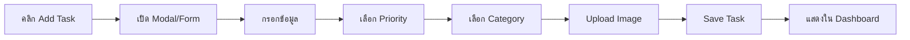
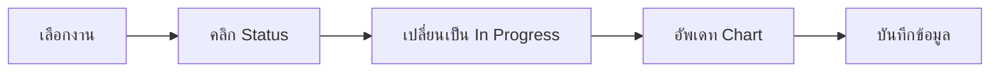
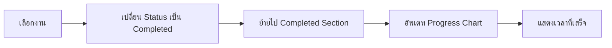

# 📋 การวิเคราะห์ Figma Design - To-Do List Web App


## 🎨 ภาพรวมของ Design

แบบ Figma นี้เป็น To-Do List Web Application ที่มีการออกแบบที่ทันสมัยและใช้งานง่าย โดยมีโครงสร้างหลักดังนี้:

### 1. **Layout Structure**

#### Sidebar Navigation (ด้านซ้าย)

- Logo และชื่อแอป
- เมนูหลัก:
  - 📊 **Dashboard** - หน้าแรกแสดงภาพรวม
  - ⭐ **Vital Task** - งานสำคัญ/เร่งด่วน
  - 📝 **My Task** - งานทั้งหมดของฉัน
  - 📂 **Task Categories** - หมวดหมู่งาน
  - ⚙️ **Settings** - การตั้งค่า
  - ❓ **Help** - ความช่วยเหลือ
  - 🚪 **Logout** - ออกจากระบบ

#### Top Navigation Bar

- 🔍 **Search Bar** - ค้นหางาน
- 🔔 **Notification Icon** - การแจ้งเตือน
- 📅 **Calendar Icon** - ปฏิทิน
- 👤 **User Profile** - ข้อมูลผู้ใช้

#### Main Content Area

แบ่งออกเป็น 3 ส่วนหลัก:

1. **To-Do Section** (ซ้าย)
   - แสดงรายการงานที่ต้องทำ
   - แต่ละ Task Card มี:
     - ชื่องาน
     - คำอธิบาย
     - รูปภาพประกอบ
     - Priority Level (Moderate, High, Low)
     - Status (Not Started, In Progress, Completed)
     - วันที่สร้าง
     - ปุ่ม More Options (...)

2. **Task Status Charts** (ขวาบน)
   - Circular Progress Charts แสดง:
     - ✅ Completed: 84%
     - 🔄 In Progress: 46%
     - ⏸️ Not Started: 13%

3. **Completed Tasks** (ขวาล่าง)
   - รายการงานที่เสร็จแล้ว
   - แสดงเวลาที่ทำเสร็จ (เช่น "2 days ago")

---

## 🎯 Features ที่ต้องพัฒนา

### ✅ Features ที่มีอยู่แล้ว (จากโค้ดปัจจุบัน)

| Feature                | Status    | ไฟล์ที่เกี่ยวข้อง                                                                                                             |
| ---------------------- | --------- | ----------------------------------------------------------------------------------------------------------------------------- |
| Dashboard Layout       | ✅ มีแล้ว | [Dashboard.tsx](file:///Users/suphanatpanyakoms/Desktop/pruek/to-do-list/src/features/dashboard/pages/Dashboard.tsx)          |
| Sidebar Navigation     | ✅ มีแล้ว | [Sidebar.tsx](file:///Users/suphanatpanyakoms/Desktop/pruek/to-do-list/src/components/layout/Sidebar/Sidebar.tsx)             |
| Top Navbar             | ✅ มีแล้ว | [TopNavbar.tsx](file:///Users/suphanatpanyakoms/Desktop/pruek/to-do-list/src/components/layout/TopNavbar/TopNavbar.tsx)       |
| Task Cards (Mock Data) | ✅ มีแล้ว | [Dashboard.tsx](file:///Users/suphanatpanyakoms/Desktop/pruek/to-do-list/src/features/dashboard/pages/Dashboard.tsx)          |
| Circle Charts          | ✅ มีแล้ว | [Dashboard.tsx](file:///Users/suphanatpanyakoms/Desktop/pruek/to-do-list/src/features/dashboard/pages/Dashboard.tsx#L72-L123) |
| Avatar Group           | ✅ มีแล้ว | [AvatarGroup.tsx](file:///Users/suphanatpanyakoms/Desktop/pruek/to-do-list/src/features/dashboard/components/AvatarGroup.tsx) |

### 🔨 Features ที่ต้องพัฒนาเพิ่มเติม

#### 1. **Core Functionality**

- [ ] ระบบ CRUD สำหรับ Tasks
  - Create: เพิ่มงานใหม่
  - Read: แสดงรายการงาน
  - Update: แก้ไขงาน
  - Delete: ลบงาน
- [ ] ระบบจัดการ Priority (Low, Moderate, High)
- [ ] ระบบจัดการ Status (Not Started, In Progress, Completed)
- [ ] ระบบค้นหางาน (Search)
- [ ] ระบบ Filter และ Sort งาน

#### 2. **Task Management**

- [ ] Modal/Form สำหรับเพิ่ม/แก้ไขงาน
- [ ] Upload รูปภาพประกอบงาน
- [ ] กำหนดวันครบกำหนด (Due Date)
- [ ] เพิ่ม Tags/Labels
- [ ] Drag & Drop เพื่อเปลี่ยน Status

#### 3. **Categories & Organization**

- [ ] สร้างและจัดการหมวดหมู่งาน
- [ ] กำหนดสีให้กับหมวดหมู่
- [ ] Filter งานตามหมวดหมู่

#### 4. **Collaboration Features**

- [ ] เชิญผู้ใช้เข้าร่วม (Invite Button)
- [ ] มอบหมายงานให้ผู้อื่น
- [ ] แสดง Assignees ในแต่ละงาน
- [ ] ระบบแจ้งเตือน (Notifications)

#### 5. **Data Visualization**

- [ ] อัพเดท Charts แบบ Real-time
- [ ] แสดงสถิติการทำงาน
- [ ] กราฟแสดงความก้าวหน้า

#### 6. **User Experience**

- [ ] Responsive Design (Mobile, Tablet, Desktop)
- [ ] Dark Mode
- [ ] Animations & Transitions
- [ ] Loading States
- [ ] Empty States
- [ ] Error Handling

#### 7. **Settings & Preferences**

- [ ] จัดการโปรไฟล์ผู้ใช้
- [ ] เปลี่ยนรูปโปรไฟล์
- [ ] ตั้งค่าการแจ้งเตือน
- [ ] ตั้งค่าภาษา

#### 8. **Data Persistence**

- [ ] เชื่อมต่อ Backend API
- [ ] Local Storage สำหรับ Offline Mode
- [ ] State Management (Context API / Zustand / Redux)

---

## 🏗️ โครงสร้างโปรเจกต์ปัจจุบัน

```
src/
├── components/
│   ├── common/
│   │   └── Input/
│   │       ├── CommonInput.tsx
│   │       └── index.ts
│   └── layout/
│       ├── MainLayout/
│       │   └── MainLayout.tsx
│       ├── Sidebar/
│       │   └── Sidebar.tsx
│       └── TopNavbar/
│           └── TopNavbar.tsx
├── features/
│   ├── dashboard/
│   │   ├── components/
│   │   │   └── AvatarGroup.tsx
│   │   └── pages/
│   │       └── Dashboard.tsx
│   ├── help/
│   ├── my-task/
│   ├── settings/
│   ├── task-categories/
│   ├── test/
│   └── vital-task/
├── routes/
│   ├── PrivateRoute.tsx
│   ├── PublicRoute.tsx
│   └── index.tsx
├── App.tsx
└── main.tsx
```

---

## 📊 การวิเคราะห์ UI Components

### 1. **Task Card Component**

**ข้อมูลที่ต้องแสดง:**

```typescript
interface Task {
  id: string | number
  title: string
  description: string
  image?: string
  priority: 'Low' | 'Moderate' | 'High'
  status: 'Not Started' | 'In Progress' | 'Completed'
  createdOn: string | Date
  dueDate?: string | Date
  category?: string
  assignees?: User[]
  tags?: string[]
}
```

**UI Elements:**

- ✅ Checkbox/Circle indicator (แสดงสถานะ)
- 📝 Title (ชื่องาน)
- 📄 Description (คำอธิบาย)
- 🖼️ Image (รูปภาพ)
- 🎯 Priority Badge
- 📊 Status Badge
- 📅 Created Date
- ⋯ More Options Menu

### 2. **Circle Progress Chart Component**

**Props:**

```typescript
interface CircleChartProps {
  percentage: number
  color: string
  label: string
  size?: 'sm' | 'md' | 'lg'
}
```

**Features:**

- SVG-based circular progress
- Animated transitions
- Color-coded by status
- Percentage display

### 3. **Filter & Search Bar**

**Functionality:**

- ค้นหาตามชื่องาน
- Filter ตาม Status
- Filter ตาม Priority
- Filter ตาม Category
- Sort by Date/Priority

---

## 🎨 Design System

### Color Palette (จาก Figma)

| สี                  | Hex Code  | ใช้สำหรับ                |
| ------------------- | --------- | ------------------------ |
| Primary             | `#6C5CE7` | ปุ่มหลัก, Links, Icons   |
| Success/Completed   | `#22c55e` | งานเสร็จ, Success states |
| Info/In Progress    | `#3b82f6` | งานกำลังทำ               |
| Warning/Not Started | `#ef4444` | งานยังไม่เริ่ม           |
| Gray                | `#6b7280` | Text secondary           |
| Dark Gray           | `#1f2937` | Text primary             |
| Light Gray          | `#f3f4f6` | Backgrounds              |

### Typography

- **Font Family:** Inter (หรือ System Font)
- **Headings:** Bold, 18-24px
- **Body:** Regular, 14-16px
- **Small Text:** 12-14px

### Spacing

- **Card Padding:** 20-24px
- **Gap between cards:** 16px
- **Section spacing:** 24px

---

## 🔄 User Flows

### 1. **สร้างงานใหม่**



### 2. **อัพเดทสถานะงาน**



### 3. **ทำงานเสร็จ**



---

## 🚀 Technology Stack

### Frontend

- ⚛️ **React 19** - UI Library
- 📘 **TypeScript** - Type Safety
- 🎨 **Tailwind CSS** - Styling
- 🐜 **Ant Design** - UI Components
- 🎯 **Lucide React** - Icons
- 📊 **Recharts** - Charts (ถ้าต้องการ advanced charts)
- 🛣️ **React Router** - Routing

### State Management (แนะนำ)

- 🔄 **Context API** - สำหรับ global state
- 🗂️ **React Query** - สำหรับ data fetching (ถ้ามี API)
- 💾 **Local Storage** - สำหรับ persistence

### Development Tools

- ⚡ **Vite** - Build Tool
- 🔍 **ESLint** - Linting
- 💅 **Prettier** - Code Formatting

---

## 📱 Responsive Breakpoints

| Device  | Width          | Layout Changes                    |
| ------- | -------------- | --------------------------------- |
| Mobile  | < 640px        | Stack all sections vertically     |
| Tablet  | 640px - 1024px | 2-column layout for some sections |
| Desktop | > 1024px       | Full 2-column layout as designed  |

---

## ⚠️ ข้อควรระวังและข้อเสนอแนะ

### 1. **Performance**

- ใช้ `React.memo` สำหรับ Task Cards
- Virtualization สำหรับรายการงานจำนวนมาก
- Lazy loading สำหรับรูปภาพ

### 2. **Accessibility**

- เพิ่ม ARIA labels
- รองรับ Keyboard navigation
- Color contrast ต้องผ่านมาตรฐาน WCAG

### 3. **Data Validation**

- Validate input ก่อนบันทึก
- แสดง Error messages ที่ชัดเจน
- ป้องกัน XSS attacks

### 4. **User Experience**

- Loading states สำหรับทุก action
- Optimistic updates
- Undo/Redo functionality
- Confirmation dialogs สำหรับการลบ

---

## 📝 สรุป

แบบ Figma นี้มีการออกแบบที่ดีและครบถ้วน โดยโค้ดปัจจุบันของคุณมี:

✅ **มีอยู่แล้ว (30%)**

- Layout structure
- Basic UI components
- Mock data display
- Routing setup

🔨 **ต้องพัฒนาต่อ (70%)**

- CRUD functionality
- State management
- API integration
- Advanced features (search, filter, notifications)
- Responsive design improvements
- Data persistence

ขั้นตอนถัดไปคือการวางแผนการพัฒนาแบบ Phase by Phase เพื่อให้ทำงานได้อย่างเป็นระบบและมีประสิทธิภาพ
