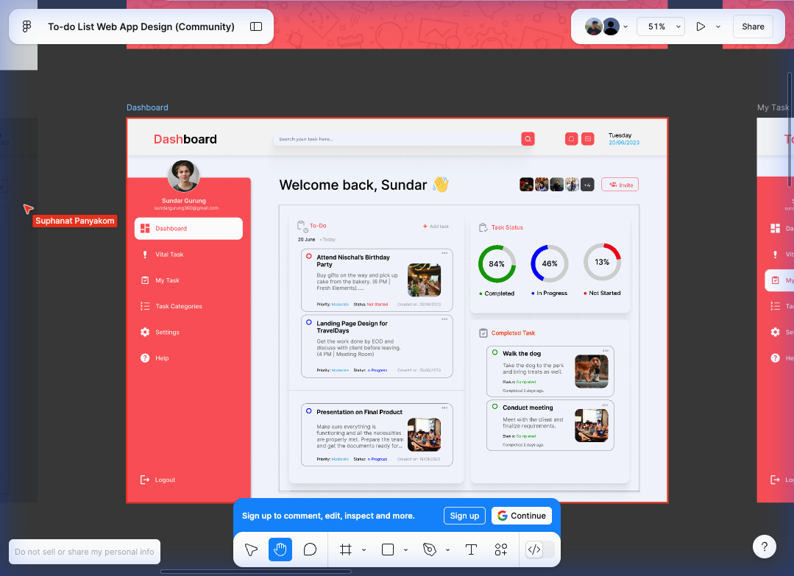
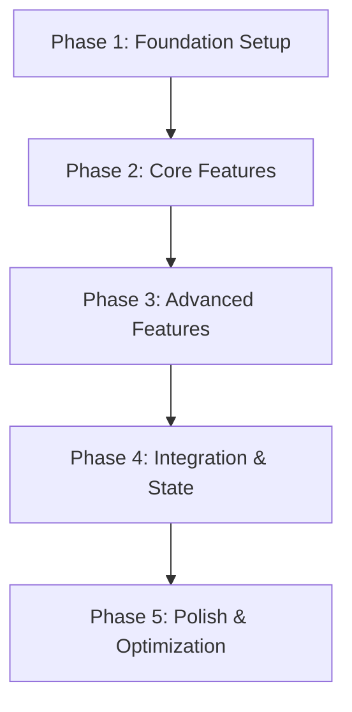

# 🎯 Implementation Plan - To-Do List Web App

## 📋 ภาพรวมโปรเจกต์

พัฒนา To-Do List Web Application ตามแบบ Figma Design โดยเพิ่ม features และ functionality ให้ครบถ้วนตามที่วิเคราะห์ไว้ใน [design_analysis.md](./design_analysis.md)

---

## 🎨 Design Reference

- **Figma URL:** [To-do List Web App Design](https://www.figma.com/design/xLaCsAk9Eie90BvimrAAvt/To-do-List-Web-App-Design--Community-?node-id=16-35&t=QkgJMmbq5tY9BQqB-0)
- **Design Screenshot:** 

---

## 🚀 Development Phases

แบ่งการพัฒนาออกเป็น **5 Phases** หลัก:



---

## 📦 Phase 1: Foundation Setup & Component Refactoring

**Timeline:** 1-2 วัน
**Priority:** 🔴 สูงสุด

### 1.1 Type Definitions & Interfaces

#### [NEW] [types/task.ts](file:///Users/suphanatpanyakoms/Desktop/pruek/to-do-list/src/types/task.ts)

สร้าง TypeScript interfaces สำหรับ Task และ related types:

```typescript
// Task types
export type TaskPriority = 'Low' | 'Moderate' | 'High'
export type TaskStatus = 'Not Started' | 'In Progress' | 'Completed'

export interface Task {
  id: string
  title: string
  description: string
  image?: string
  priority: TaskPriority
  status: TaskStatus
  createdOn: Date
  dueDate?: Date
  category?: string
  assignees?: string[]
  tags?: string[]
  completedAt?: Date
}

export interface TaskCategory {
  id: string
  name: string
  color: string
  icon?: string
}

export interface TaskStats {
  total: number
  completed: number
  inProgress: number
  notStarted: number
}
```

#### [NEW] [types/user.ts](file:///Users/suphanatpanyakoms/Desktop/pruek/to-do-list/src/types/user.ts)

```typescript
export interface User {
  id: string
  name: string
  email: string
  avatar?: string
  role?: string
}
```

---

### 1.2 Component Refactoring

#### [NEW] [components/common/TaskCard/TaskCard.tsx](file:///Users/suphanatpanyakoms/Desktop/pruek/to-do-list/src/components/common/TaskCard/TaskCard.tsx)

แยก Task Card ออกมาเป็น reusable component:

```typescript
interface TaskCardProps {
  task: Task
  onEdit?: (task: Task) => void
  onDelete?: (taskId: string) => void
  onStatusChange?: (taskId: string, status: TaskStatus) => void
  variant?: 'default' | 'completed'
}
```

**Features:**

- แสดงข้อมูลงานครบถ้วน
- Priority badge with color coding
- Status badge with color coding
- More options menu (Edit, Delete, Change Status)
- Image display
- Responsive layout

---

#### [NEW] [components/common/CircleChart/CircleChart.tsx](file:///Users/suphanatpanyakoms/Desktop/pruek/to-do-list/src/components/common/CircleChart/CircleChart.tsx)

แยก Circle Chart component ออกมา:

```typescript
interface CircleChartProps {
  percentage: number
  color: string
  label: string
  size?: 'sm' | 'md' | 'lg'
  showAnimation?: boolean
}
```

---

#### [NEW] [components/common/PriorityBadge/PriorityBadge.tsx](file:///Users/suphanatpanyakoms/Desktop/pruek/to-do-list/src/components/common/PriorityBadge/PriorityBadge.tsx)

```typescript
interface PriorityBadgeProps {
  priority: TaskPriority
  size?: 'sm' | 'md' | 'lg'
}
```

---

#### [NEW] [components/common/StatusBadge/StatusBadge.tsx](file:///Users/suphanatpanyakoms/Desktop/pruek/to-do-list/src/components/common/StatusBadge/StatusBadge.tsx)

```typescript
interface StatusBadgeProps {
  status: TaskStatus
  size?: 'sm' | 'md' | 'lg'
}
```

---

### 1.3 Utility Functions

#### [NEW] [utils/taskUtils.ts](file:///Users/suphanatpanyakoms/Desktop/pruek/to-do-list/src/utils/taskUtils.ts)

```typescript
// Helper functions สำหรับจัดการ tasks
export const calculateTaskStats = (tasks: Task[]): TaskStats => {}
export const filterTasksByStatus = (
  tasks: Task[],
  status: TaskStatus
): Task[] => {}
export const sortTasksByPriority = (tasks: Task[]): Task[] => {}
export const sortTasksByDate = (
  tasks: Task[],
  order: 'asc' | 'desc'
): Task[] => {}
export const searchTasks = (tasks: Task[], query: string): Task[] => {}
```

#### [NEW] [utils/dateUtils.ts](file:///Users/suphanatpanyakoms/Desktop/pruek/to-do-list/src/utils/dateUtils.ts)

```typescript
export const formatDate = (date: Date): string => {}
export const getRelativeTime = (date: Date): string => {} // "2 days ago"
export const isOverdue = (dueDate: Date): boolean => {}
```

---

### 1.4 Constants

#### [NEW] [constants/colors.ts](file:///Users/suphanatpanyakoms/Desktop/pruek/to-do-list/src/constants/colors.ts)

```typescript
export const PRIORITY_COLORS = {
  Low: '#22c55e',
  Moderate: '#3b82f6',
  High: '#ef4444',
}

export const STATUS_COLORS = {
  'Not Started': '#ef4444',
  'In Progress': '#3b82f6',
  Completed: '#22c55e',
}
```

---

## 📝 Phase 2: Core CRUD Features

**Timeline:** 2-3 วัน
**Priority:** 🔴 สูง

### 2.1 State Management Setup

#### [NEW] [contexts/TaskContext.tsx](file:///Users/suphanatpanyakoms/Desktop/pruek/to-do-list/src/contexts/TaskContext.tsx)

สร้าง Context API สำหรับจัดการ tasks:

```typescript
interface TaskContextType {
  tasks: Task[]
  addTask: (task: Omit<Task, 'id' | 'createdOn'>) => void
  updateTask: (taskId: string, updates: Partial<Task>) => void
  deleteTask: (taskId: string) => void
  getTaskById: (taskId: string) => Task | undefined
  stats: TaskStats
}
```

**Features:**

- CRUD operations
- Auto-calculate stats
- Local storage persistence
- Optimistic updates

---

### 2.2 Task Form Modal

#### [NEW] [components/features/TaskForm/TaskFormModal.tsx](file:///Users/suphanatpanyakoms/Desktop/pruek/to-do-list/src/components/features/TaskForm/TaskFormModal.tsx)

Modal สำหรับเพิ่ม/แก้ไขงาน:

```typescript
interface TaskFormModalProps {
  open: boolean
  onClose: () => void
  task?: Task // สำหรับ edit mode
  onSubmit: (task: Partial<Task>) => void
}
```

**Form Fields:**

- ✅ Title (required)
- ✅ Description (required)
- ✅ Priority (dropdown)
- ✅ Status (dropdown)
- ✅ Due Date (date picker)
- ✅ Category (dropdown)
- ✅ Image Upload
- ✅ Tags (multi-select)

**Validation:**

- Title ต้องไม่เกิน 100 ตัวอักษร
- Description ต้องไม่เกิน 500 ตัวอักษร
- Due date ต้องไม่เป็นวันที่ผ่านมาแล้ว

---

### 2.3 Task Actions

#### [MODIFY] [components/common/TaskCard/TaskCard.tsx](file:///Users/suphanatpanyakoms/Desktop/pruek/to-do-list/src/components/common/TaskCard/TaskCard.tsx)

เพิ่ม More Options Menu:

```typescript
// Actions:
- Edit Task → เปิด TaskFormModal
- Delete Task → แสดง Confirmation Dialog
- Change Status → Dropdown menu
- Mark as Important
- Duplicate Task
```

---

### 2.4 Update Dashboard

#### [MODIFY] [features/dashboard/pages/Dashboard.tsx](file:///Users/suphanatpanyakoms/Desktop/pruek/to-do-list/src/features/dashboard/pages/Dashboard.tsx)

**Changes:**

- ลบ mock data
- ใช้ TaskContext แทน
- เชื่อมต่อ Add Task button กับ TaskFormModal
- Real-time update charts
- แสดง empty state เมื่อไม่มีงาน

---

## 🔍 Phase 3: Advanced Features

**Timeline:** 2-3 วัน
**Priority:** 🟡 ปานกลาง

### 3.1 Search & Filter

#### [NEW] [components/features/TaskFilters/TaskFilters.tsx](file:///Users/suphanatpanyakoms/Desktop/pruek/to-do-list/src/components/features/TaskFilters/TaskFilters.tsx)

```typescript
interface TaskFiltersProps {
  onFilterChange: (filters: TaskFilters) => void
  onSearchChange: (query: string) => void
}

interface TaskFilters {
  status?: TaskStatus[]
  priority?: TaskPriority[]
  category?: string[]
  dateRange?: { start: Date; end: Date }
}
```

**UI Components:**

- 🔍 Search input
- 📊 Status filter (checkboxes)
- 🎯 Priority filter (checkboxes)
- 📂 Category filter (dropdown)
- 📅 Date range picker
- 🔄 Reset filters button

---

### 3.2 Task Categories Management

#### [NEW] [features/task-categories/components/CategoryList.tsx](file:///Users/suphanatpanyakoms/Desktop/pruek/to-do-list/src/features/task-categories/components/CategoryList.tsx)

#### [NEW] [features/task-categories/components/CategoryForm.tsx](file:///Users/suphanatpanyakoms/Desktop/pruek/to-do-list/src/features/task-categories/components/CategoryForm.tsx)

#### [MODIFY] [features/task-categories/pages/TaskCategoriesPage.tsx](file:///Users/suphanatpanyakoms/Desktop/pruek/to-do-list/src/features/task-categories/pages/TaskCategoriesPage.tsx)

**Features:**

- สร้าง/แก้ไข/ลบ categories
- กำหนดสีให้กับ category
- เลือก icon
- แสดงจำนวนงานในแต่ละ category

---

### 3.3 My Task Page

#### [MODIFY] [features/my-task/pages/MyTaskPage.tsx](file:///Users/suphanatpanyakoms/Desktop/pruek/to-do-list/src/features/my-task/pages/MyTaskPage.tsx)

**Features:**

- แสดงงานทั้งหมด
- Group by status/priority/category
- Kanban board view (optional)
- List view
- Calendar view (optional)

---

### 3.4 Vital Task Page

#### [MODIFY] [features/vital-task/pages/VitalTaskPage.tsx](file:///Users/suphanatpanyakoms/Desktop/pruek/to-do-list/src/features/vital-task/pages/VitalTaskPage.tsx)

**Features:**

- แสดงงานที่มี Priority = High
- แสดงงานที่ใกล้ครบกำหนด
- แสดงงานที่ถูก mark as important

---

## 🔗 Phase 4: Integration & State Management

**Timeline:** 1-2 วัน
**Priority:** 🟡 ปานกลาง

### 4.1 Local Storage Persistence

#### [NEW] [hooks/useLocalStorage.ts](file:///Users/suphanatpanyakoms/Desktop/pruek/to-do-list/src/hooks/useLocalStorage.ts)

```typescript
export const useLocalStorage = <T>(key: string, initialValue: T) => {
  // Auto-save to localStorage
  // Auto-load from localStorage
}
```

---

### 4.2 Custom Hooks

#### [NEW] [hooks/useTasks.ts](file:///Users/suphanatpanyakoms/Desktop/pruek/to-do-list/src/hooks/useTasks.ts)

```typescript
export const useTasks = () => {
  // Wrapper around TaskContext
  // Additional helper functions
}
```

#### [NEW] [hooks/useTaskFilters.ts](file:///Users/suphanatpanyakoms/Desktop/pruek/to-do-list/src/hooks/useTaskFilters.ts)

```typescript
export const useTaskFilters = (tasks: Task[]) => {
  // Filter logic
  // Search logic
  // Sort logic
}
```

---

### 4.3 Notification System

#### [NEW] [components/common/Notification/Notification.tsx](file:///Users/suphanatpanyakoms/Desktop/pruek/to-do-list/src/components/common/Notification/Notification.tsx)

#### [NEW] [contexts/NotificationContext.tsx](file:///Users/suphanatpanyakoms/Desktop/pruek/to-do-list/src/contexts/NotificationContext.tsx)

**Features:**

- Success notifications
- Error notifications
- Info notifications
- Auto-dismiss
- Toast style

---

## ✨ Phase 5: Polish & Optimization

**Timeline:** 2-3 วัน
**Priority:** 🟢 ต่ำ

### 5.1 Responsive Design

#### [MODIFY] ทุกไฟล์ component

**Breakpoints:**

- Mobile: < 640px
- Tablet: 640px - 1024px
- Desktop: > 1024px

**Changes:**

- Stack layout on mobile
- Adjust sidebar (drawer on mobile)
- Responsive task cards
- Responsive charts

---

### 5.2 Animations & Transitions

#### [NEW] [styles/animations.css](file:///Users/suphanatpanyakoms/Desktop/pruek/to-do-list/src/styles/animations.css)

**Animations:**

- Fade in/out
- Slide in/out
- Scale animations
- Loading spinners
- Skeleton screens

---

### 5.3 Empty States

#### [NEW] [components/common/EmptyState/EmptyState.tsx](file:///Users/suphanatpanyakoms/Desktop/pruek/to-do-list/src/components/common/EmptyState/EmptyState.tsx)

**Scenarios:**

- ไม่มีงาน
- ไม่มีผลการค้นหา
- ไม่มี category
- Error states

---

### 5.4 Loading States

#### [NEW] [components/common/Loading/Loading.tsx](file:///Users/suphanatpanyakoms/Desktop/pruek/to-do-list/src/components/common/Loading/Loading.tsx)

**Types:**

- Full page loading
- Component loading
- Button loading
- Skeleton loading

---

### 5.5 Settings Page

#### [MODIFY] [features/settings/pages/SettingPage.tsx](file:///Users/suphanatpanyakoms/Desktop/pruek/to-do-list/src/features/settings/pages/SettingPage.tsx)

**Settings:**

- ✅ User profile
- ✅ Change avatar
- ✅ Notification preferences
- ✅ Theme (Light/Dark)
- ✅ Language
- ✅ Export data
- ✅ Import data

---

### 5.6 Help Page

#### [MODIFY] [features/help/pages/HelpPage.tsx](file:///Users/suphanatpanyakoms/Desktop/pruek/to-do-list/src/features/help/pages/HelpPage.tsx)

**Content:**

- FAQ
- User guide
- Keyboard shortcuts
- Contact support

---

## 🧪 Verification Plan

### Automated Tests

```bash
# Unit tests สำหรับ utility functions
npm run test

# Component tests
npm run test:components

# E2E tests (optional)
npm run test:e2e
```

### Manual Verification

**Checklist:**

- [ ] สร้างงานใหม่ได้
- [ ] แก้ไขงานได้
- [ ] ลบงานได้
- [ ] เปลี่ยนสถานะงานได้
- [ ] ค้นหางานได้
- [ ] Filter งานได้
- [ ] Charts แสดงผลถูกต้อง
- [ ] Responsive ทุก breakpoint
- [ ] Local storage ทำงานถูกต้อง
- [ ] Animations smooth
- [ ] Empty states แสดงผล
- [ ] Loading states แสดงผล
- [ ] Error handling ทำงาน

---

## 📊 Progress Tracking

| Phase                      | Status         | Progress |
| -------------------------- | -------------- | -------- |
| Phase 1: Foundation        | ⏸️ Not Started | 0%       |
| Phase 2: Core Features     | ⏸️ Not Started | 0%       |
| Phase 3: Advanced Features | ⏸️ Not Started | 0%       |
| Phase 4: Integration       | ⏸️ Not Started | 0%       |
| Phase 5: Polish            | ⏸️ Not Started | 0%       |

---

## 🎯 Success Criteria

✅ **MVP (Minimum Viable Product)**

- CRUD operations ทำงานได้
- Dashboard แสดงผลถูกต้อง
- Charts แสดงสถิติ real-time
- Responsive design

✅ **Full Product**

- ทุก features ตาม Figma design
- Search & Filter ทำงานได้
- Categories management
- Settings & Preferences
- Animations & Transitions
- Error handling & Loading states

---

## 📝 Notes

> [!IMPORTANT]
>
> - ควรทำทีละ Phase เพื่อให้ง่ายต่อการ debug และ test
> - แต่ละ Phase ควร commit แยกตามกฎการตั้งชื่อ commit
> - ใช้ TypeScript อย่างเต็มที่เพื่อ type safety

> [!TIP]
>
> - ใช้ Ant Design components เพื่อเร่งการพัฒนา
> - ใช้ Tailwind CSS สำหรับ custom styling
> - ใช้ React.memo เพื่อ optimize performance

> [!WARNING]
>
> - ระวังการใช้ inline styles มากเกินไป
> - ควร extract reusable components
> - ต้องมี error boundary สำหรับ catch errors
